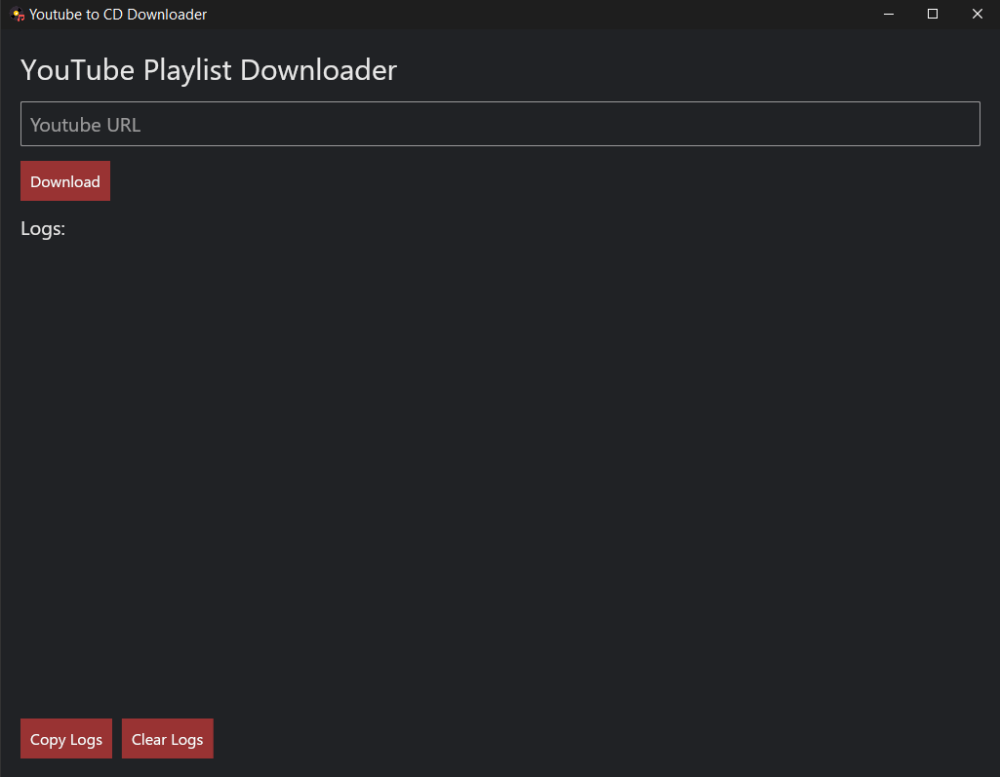

<h1> Youtube to CD</h1>

Youtube to CD is a simple program written in <a href="https://www.rust-lang.org/">Rust</a> which automatically downloads videos and playlists from Youtube only assigned a simple URL and then converted into WAV to make it easy to burn to CDs. This is ideal for those who want an offline library of their favourite songs

<h2>Usage</h2>
TODO
<h2>Installation</h2>
TODO